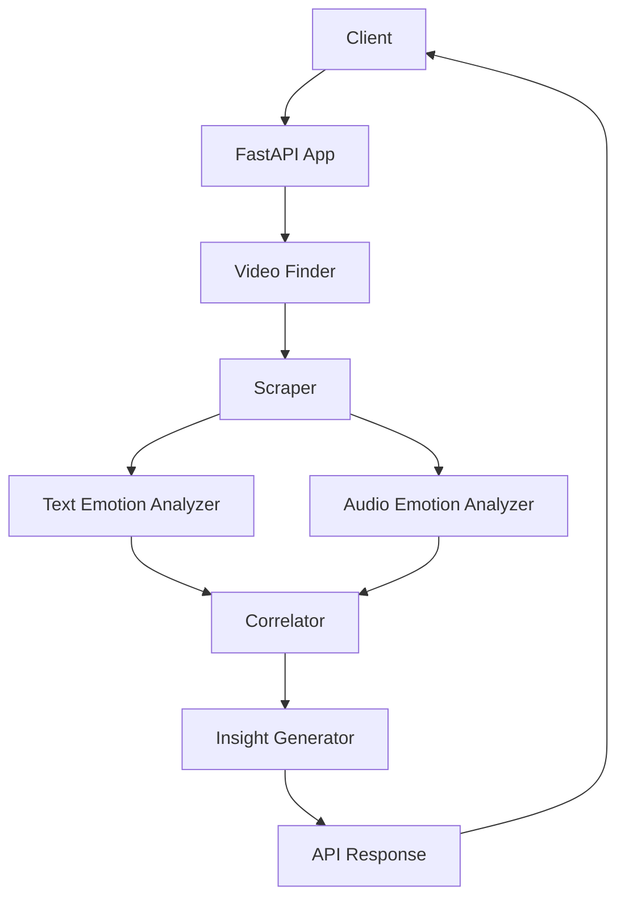

# Cooper API

A powerful API for analyzing video content, emotions, and generating insights from online videos.

## Overview

Cooper API is a comprehensive video content analysis tool that:
- Finds relevant videos based on your query
- Scrapes video data including comments
- Analyzes emotions in text and audio
- Computes correlations between various factors
- Generates actionable insights and PR hooks

## Getting Started

### Prerequisites
- Python 3.12+
- API keys for required services

### Installation

1. Clone the repository
```bash
git clone https://github.com/yourusername/cooper-mvp.git
cd cooper-mvp
```

2. Create .env file from the example
```bash
cp .env.example .env
```
Edit the .env file to add your API keys.

3. Install dependencies
```bash
pip install -r requirements.txt
```

4. Start the FastAPI server
```bash
uvicorn src.app:app --reload
```

5. The API will be available at http://127.0.0.1:8000

### Sample API Calls

#### Using cURL
```bash
curl -X 'GET' \
  'http://127.0.0.1:8000/chat?query=sustainable%20fashion&limit=5' \
  -H 'accept: application/json'
```

#### Using HTTPie
```bash
http GET http://127.0.0.1:8000/chat query==sustainable%20fashion limit==5
```

## Architecture



## API Documentation

The API documentation is available at http://127.0.0.1:8000/docs when the server is running.

## Docker Support

You can run the application using Docker:

```bash
docker build -t cooper-api .
docker run -p 8000:8000 cooper-api
```

Or using Docker Compose:

```bash
docker-compose up
```
